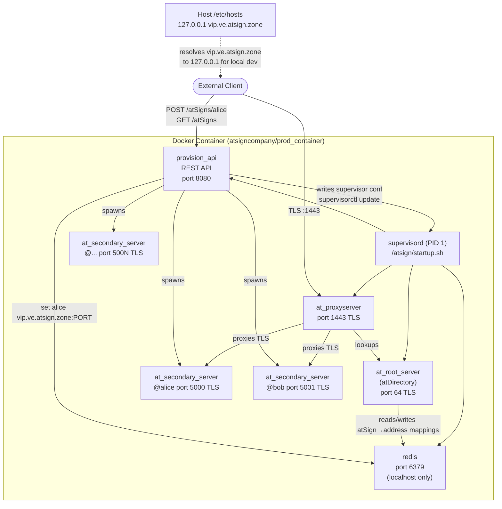

# prod_container

## Goals

- Run multiple AtServers within a single Docker container (similar to ephemeral container).
- Contains a REST API (`provision_api`) that controls the provisioning of AtServers (start, reset, delete, restart, stop). Container initially starts with 0 AtServers.
- Dynamic number of atSigns/AtServers limited only by host resources.
- Certs for `vip.ve.atsign.zone` are baked in at build time and refreshed monthly via `refreshcerts.yaml`.
- AtServer and AtDirectory storage is externalized so the container can be swarmed.
- Proxy server (`at_proxyserver`) is built into the image.

## Acceptance Criteria

Below are described end-states and *things* that the end-consumer (user of the Docker image) should be able to do.

### Scenario 1 : Out of the Box for POC

- Proxy Server: enabled (on a defined port)
- Certs: handled by Atsign (Don't have to worry about certs, only have to worry about refreshing the image)
- Redundancy: none

As an enterprise customer, I should be able to 
1. download the image from Docker hub OR build it myself locally
2. Run the image using default configuration (it has its own certs for vip.ve.atsign.zone)
3. I can run apps that connect to the Atsign Environment via `proxy:vip.ve.atsign.zone:443` or even `proxy:vip.ve.atsign.zone:1025` (let's say I want the proxy port to be on another port)
4. I should be able to `nmap` the network and only find that the proxy port (such as 443 or 1025) is open.
5. Let's say that I have the container running (proxy server, atDirectory, and one AtServer `@alice`.) Then I run `openssl s_client -connect vip.ve.atsign.zone:443`, and type "alice", it should return `vip.ve.atsign.zone:443`. This is because of the `at_services/packages/at_secondary_server` behaviour of the proxy server which tells the client to reconnect on that same host:port which will redirect traffic to the correct AtServer

### Scenario 2 : Production Mode

- Proxy Server: enabled (on a defined port, e.g. 443)
- Certs: handled by consumer
- Redundancy: swarmed

As an enterprise customer, I have my own certs (that I am capable of managing myself).

1. Download the image from Docker Hub or build it myself locally
2. Similar to scenario 1 but
3. I can create volumes (or use some sort of mechanism) so that storage is externalized.
4. There should be documentation of what directories are externalized so that I can properly have it so that storage exists in one place
5. Then I can swarm the container so that the process is resilient and can handle a big load

## Test Cases

### Setup (Before All Tests)

Goal: a clean, known-good container with no prior state.

> **Note:** All host-side volume paths use `/tmp` so they are automatically cleaned up on reboot and don't leave state on your machine.

```bash
# 1. Remove any leftover container from a previous run
docker rm -f prod_container_test 2>/dev/null || true

# 2. Remove any leftover test volumes
rm -rf /tmp/prod_atservers_test /tmp/prod_redis_test /tmp/prod_supervisor_conf_test
mkdir -p /tmp/prod_atservers_test /tmp/prod_redis_test /tmp/prod_supervisor_conf_test

# 3. Start a fresh container with test volumes
docker run -d \
    --name prod_container_test \
    -p 1443:1443 \
    -p 3000:3000 \
    -p 15000:5000 \
    -e PROXY_URL=vip.ve.atsign.zone:443 \
    -e EXTERNAL_BASE_PORT=15000 \
    -v /tmp/prod_atservers_test:/atsign/atservers \
    -v /tmp/prod_redis_test:/atsign/redis \
    -v /tmp/prod_supervisor_conf_test:/atsign/supervisor/conf.d \
    atsigncompany/prod_container:dev

# 4. Wait until all four base processes are RUNNING (timeout 30s)
timeout 30 bash -c \
    'until docker exec prod_container_test supervisorctl status | grep -E "redis|root_server|proxy_server|provision_api" | grep -v RUNNING | wc -l | grep -q "^0$"; do sleep 1; done'
```

### Teardown (After All Tests)

Goal: leave the host in the same state as before the tests ran.

```bash
# 1. Stop and remove the container
docker rm -f prod_container_test

# 2. Remove test volume directories
rm -rf /tmp/prod_atservers_test /tmp/prod_redis_test /tmp/prod_supervisor_conf_test
```

> **Note:** The persistence test (Test 7) stops and restarts the container mid-test. It should be run last and uses its own isolated setup/teardown so it does not affect the other tests.

---

### Test 1 — Container Startup

- **Setup:** Container started as per global setup above.
- **Action:** Wait up to 10s after container start.
- **Expected:** All four base processes are `RUNNING`.
- **Verify:**
  ```bash
  docker exec prod_container_test supervisorctl status
  # Expected: redis, root_server, proxy_server, provision_api all show RUNNING
  ```

### Test 2 — Provision API: Happy Path

- **Setup:** Container running, no atSigns provisioned.
- **Action:** `curl -s -w "\n%{http_code}" -X POST http://localhost:3000/atSigns/alice`
- **Expected:** HTTP 201. Response body contains `"atSign":"@alice"`, a numeric `port`, and a 64-char hex `cram`.
- **Verify:**
  ```bash
  docker exec prod_container_test supervisorctl status
  # Expected: 5000_@alice  RUNNING

  docker exec prod_container_test redis-cli -a foobared --no-auth-warning get alice
  # Expected: vip.ve.atsign.zone:15000

  docker exec prod_container_test ls /atsign/atservers/@alice
  # Expected: certs  config  CRAM

  curl -s http://localhost:3000/atSigns
  # Expected: JSON array containing @alice

  curl -s http://localhost:3000/atSigns/alice
  # Expected: JSON with "atSign":"@alice" and status containing RUNNING
  ```

### Test 3 — Provision API: Error Cases

- **Setup:** `@alice` already provisioned (carried over from Test 2).
- **Actions and expected responses:**
  ```bash
  curl -s -w "\n%{http_code}" -X POST http://localhost:3000/atSigns/alice
  # Expected: HTTP 409

  curl -s -w "\n%{http_code}" http://localhost:3000/atSigns/nonexistent
  # Expected: HTTP 404
  ```

### Test 4 — atDirectory Resolution

- **Setup:** `@alice` provisioned, `/etc/hosts` has `127.0.0.1 vip.ve.atsign.zone` on the host.
- **Action:** Query Redis and the proxy directly.
- **Verify:**
  ```bash
  docker exec prod_container_test redis-cli -a foobared --no-auth-warning get alice
  # Expected: vip.ve.atsign.zone:15000

  echo "alice" | openssl s_client -connect vip.ve.atsign.zone:1443 -quiet 2>/dev/null
  # Expected: response contains vip.ve.atsign.zone:1443
  ```

### Test 5 — AtServer Lifecycle

- **Setup:** `@alice` provisioned and `RUNNING`.
- **Actions and verifications:**
  ```bash
  # Restart
  curl -s -w "\n%{http_code}" -X POST http://localhost:3000/atSigns/alice/restart
  # Expected: HTTP 200
  sleep 5
  docker exec prod_container_test supervisorctl status
  # Expected: 5000_@alice  RUNNING

  # Reset
  curl -s -w "\n%{http_code}" -X POST http://localhost:3000/atSigns/alice/reset
  # Expected: HTTP 200
  docker exec prod_container_test ls /atsign/atservers/@alice
  # Expected: only certs, config, CRAM — no hive storage directories
  docker exec prod_container_test supervisorctl status
  # Expected: 5000_@alice  RUNNING

  # Delete
  curl -s -w "\n%{http_code}" -X DELETE http://localhost:3000/atSigns/alice
  # Expected: HTTP 200
  curl -s -w "\n%{http_code}" http://localhost:3000/atSigns/alice
  # Expected: HTTP 404
  docker exec prod_container_test redis-cli -a foobared --no-auth-warning get alice
  # Expected: (empty string / nil)
  ```

### Test 6 — Port Allocation

- **Setup:** Container running, no atSigns provisioned.
- **Action:** Provision three atSigns sequentially.
  ```bash
  curl -s -X POST http://localhost:3000/atSigns/alice
  curl -s -X POST http://localhost:3000/atSigns/bob
  curl -s -X POST http://localhost:3000/atSigns/charlie
  ```
- **Verify:**
  ```bash
  docker exec prod_container_test supervisorctl status
  # Expected: 5000_@alice RUNNING, 5001_@bob RUNNING, 5002_@charlie RUNNING

  docker exec prod_container_test redis-cli -a foobared --no-auth-warning get alice
  # Expected: vip.ve.atsign.zone:15000
  docker exec prod_container_test redis-cli -a foobared --no-auth-warning get bob
  # Expected: vip.ve.atsign.zone:15001
  docker exec prod_container_test redis-cli -a foobared --no-auth-warning get charlie
  # Expected: vip.ve.atsign.zone:15002
  ```

### Test 7 — Persistence Across Restart

> Run this test last. It has its own setup and teardown.

**Setup:**
```bash
docker rm -f prod_container_persist_test 2>/dev/null || true
rm -rf /tmp/persist_atservers /tmp/persist_redis /tmp/persist_supervisor_conf
mkdir -p /tmp/persist_atservers /tmp/persist_redis /tmp/persist_supervisor_conf

docker run -d \
    --name prod_container_persist_test \
    -p 1444:1443 \
    -p 3001:3000 \
    -p 15001:5000 \
    -e PROXY_URL=vip.ve.atsign.zone:443 \
    -e EXTERNAL_BASE_PORT=15001 \
    -v /tmp/persist_atservers:/atsign/atservers \
    -v /tmp/persist_redis:/atsign/redis \
    -v /tmp/persist_supervisor_conf:/atsign/supervisor/conf.d \
    atsigncompany/prod_container:dev

sleep 10
curl -s -X POST http://localhost:3001/atSigns/alice
```

**Action:** Stop and remove the container, then start a new one with the same volumes.
```bash
docker rm -f prod_container_persist_test

docker run -d \
    --name prod_container_persist_test \
    -p 1444:1443 \
    -p 3001:3000 \
    -p 15001:5000 \
    -e PROXY_URL=vip.ve.atsign.zone:443 \
    -e EXTERNAL_BASE_PORT=15001 \
    -v /tmp/persist_atservers:/atsign/atservers \
    -v /tmp/persist_redis:/atsign/redis \
    -v /tmp/persist_supervisor_conf:/atsign/supervisor/conf.d \
    atsigncompany/prod_container:dev

sleep 10
```

**Verify:**
```bash
docker exec prod_container_persist_test supervisorctl status
# Expected: 5000_@alice  RUNNING  (no re-provisioning)

docker exec prod_container_persist_test redis-cli -a foobared --no-auth-warning get alice
# Expected: vip.ve.atsign.zone:15001

curl -s -w "\n%{http_code}" http://localhost:3001/atSigns/alice
# Expected: HTTP 200 with status RUNNING
```

**Teardown:**
```bash
docker rm -f prod_container_persist_test
rm -rf /tmp/persist_atservers /tmp/persist_redis /tmp/persist_supervisor_conf
```

---

### Test 8 — Scenario 1: Build Image Locally (Baked-in Certs)

> Covers Scenario 1 steps 1 and 2.

- **Setup:** No prior image built.
- **Action:**
  ```bash
  docker build \
      -f tools/build_prod_container/Dockerfile \
      -t atsigncompany/prod_container:dev \
      .
  ```
- **Expected:** Build completes with exit code 0.
- **Verify:**
  ```bash
  docker image inspect atsigncompany/prod_container:dev
  # Expected: image exists

  # Start container with no cert mounts — baked-in certs should be used
  docker run -d --name prod_container_test8 \
      -p 1445:1443 -p 3002:3000 \
      -e PROXY_URL=vip.ve.atsign.zone:443 \
      atsigncompany/prod_container:dev
  sleep 10

  docker exec prod_container_test8 supervisorctl status
  # Expected: redis, root_server, proxy_server, provision_api all RUNNING

  docker exec prod_container_test8 ls /atsign/root/certs
  # Expected: fullchain.pem  privkey.pem

  docker exec prod_container_test8 ls /atsign/secondary/base/certs
  # Expected: fullchain.pem  privkey.pem  cacert.pem

  docker exec prod_container_test8 ls /atsign/proxy/certs
  # Expected: fullchain.pem  privkey.pem  cacert.pem
  ```
- **Teardown:**
  ```bash
  docker rm -f prod_container_test8
  ```

### Test 9 — Scenario 1: Proxy Port is Configurable

> Covers Scenario 1 step 3 — proxy can be exposed on a custom port.

- **Setup:** Container running with proxy mapped to port 1025 instead of 443.
  ```bash
  docker run -d --name prod_container_test9 \
      -p 1025:1443 -p 3003:3000 -p 15002:5000 \
      -e PROXY_URL=vip.ve.atsign.zone:1025 \
      -e EXTERNAL_BASE_PORT=15002 \
      atsigncompany/prod_container:dev
  sleep 10
  curl -s -X POST http://localhost:3003/atSigns/alice
  sleep 3
  ```
- **Verify:**
  ```bash
  docker exec prod_container_test9 redis-cli -a foobared --no-auth-warning get alice
  # Expected: vip.ve.atsign.zone:15002

  echo "alice" | openssl s_client -connect vip.ve.atsign.zone:1025 -quiet 2>/dev/null
  # Expected: response contains vip.ve.atsign.zone:1025
  ```
- **Teardown:**
  ```bash
  docker rm -f prod_container_test9
  ```

### Test 10 — Scenario 1: openssl Proxy Redirect Returns Correct Address

> Covers Scenario 1 step 5 — sending an atSign name to the proxy returns the proxy address.

- **Setup:** Global setup container running, `@alice` provisioned, `/etc/hosts` has `127.0.0.1 vip.ve.atsign.zone`.
- **Verify:**
  ```bash
  echo "alice" | openssl s_client -connect vip.ve.atsign.zone:1443 -quiet 2>/dev/null
  # Expected: response contains vip.ve.atsign.zone:1443
  ```

### Test 11 — Scenario 1: Only Proxy Port is Externally Reachable

> Covers Scenario 1 step 4 — no unexpected ports exposed.

- **Setup:** Global setup container running (ports 1443 and 3000 published).
- **Verify:**
  ```bash
  docker inspect prod_container_test --format '{{json .NetworkSettings.Ports}}'
  # Expected: only 1443/tcp and 3000/tcp are bound on the host — no port 64, 6379, or 5000+

  # Confirm redis is not reachable from the host
  redis-cli -p 6379 ping 2>/dev/null
  # Expected: connection refused

  # Confirm root server port 64 is not reachable from the host
  nc -zv localhost 64 2>/dev/null
  # Expected: connection refused
  ```

### Test 12 — Scenario 2: Customer-Managed Certs

> Covers Scenario 2 steps 1–2 — container works with externally provided certs.

- **Setup:** Copy the baked-in certs out of the image into `/tmp` to simulate customer-provided certs, then start the container with those bind-mounted.
  ```bash
  # Extract baked-in certs to use as stand-in customer certs
  docker create --name tmp_cert_extract atsigncompany/prod_container:dev
  mkdir -p /tmp/customer_root_certs /tmp/customer_secondary_certs /tmp/customer_proxy_certs
  docker cp tmp_cert_extract:/atsign/root/certs/. /tmp/customer_root_certs/
  docker cp tmp_cert_extract:/atsign/secondary/base/certs/. /tmp/customer_secondary_certs/
  docker cp tmp_cert_extract:/atsign/proxy/certs/. /tmp/customer_proxy_certs/
  docker rm tmp_cert_extract

  docker run -d --name prod_container_test12 \
      -p 1446:1443 -p 3004:3000 -p 15003:5000 \
      -e PROXY_URL=vip.ve.atsign.zone:443 \
      -e EXTERNAL_BASE_PORT=15003 \
      -v /tmp/customer_root_certs:/atsign/root/certs \
      -v /tmp/customer_secondary_certs:/atsign/secondary/base/certs \
      -v /tmp/customer_proxy_certs:/atsign/proxy/certs \
      atsigncompany/prod_container:dev
  sleep 10
  ```
- **Verify:**
  ```bash
  docker exec prod_container_test12 supervisorctl status
  # Expected: redis, root_server, proxy_server, provision_api all RUNNING

  curl -s -w "\n%{http_code}" -X POST http://localhost:3004/atSigns/alice
  # Expected: HTTP 201

  docker exec prod_container_test12 supervisorctl status
  # Expected: 5000_@alice  RUNNING

  echo "alice" | openssl s_client -connect vip.ve.atsign.zone:1446 -quiet 2>/dev/null
  # Expected: response contains vip.ve.atsign.zone:1446
  ```
- **Teardown:**
  ```bash
  docker rm -f prod_container_test12
  rm -rf /tmp/customer_root_certs /tmp/customer_secondary_certs /tmp/customer_proxy_certs
  ```

## Architecture



## Processes (managed by supervisord)

| Order | Program | Binary | Port | Notes |
|-------|---------|--------|------|-------|
| 10 | redis | `redis-server` | 6379 | localhost only, password `foobared` |
| 20 | root_server | `at_root_server` | 64 (TLS) | atDirectory; requires redis |
| 25 | proxy_server | `at_proxyserver` | 1443 (TLS) | forwards to root + secondaries |
| 30 | provision_api | `provision_api` | 3000 | REST API for AtServer lifecycle |
| dynamic | secondary | `at_secondary_server` | 5000+ (TLS) | one per atSign, managed at runtime |

## Certificates

All certs are for `vip.ve.atsign.zone` and are fetched from GitHub at image build time by the `certfetch` stage. Rebuild the image to refresh certs.

| Location | Used by | Contents | Fetched from |
|----------|---------|----------|--------------|
| `/atsign/root/certs/` | `at_root_server` | `fullchain.pem`, `privkey.pem` | `atsign-foundation/at_server` trunk — `tools/build_ephemeral_environment/ee_base/contents/atsign/root/certs/` |
| `/atsign/secondary/base/certs/` | all `at_secondary_server` instances (symlinked) | `fullchain.pem`, `privkey.pem`, `cacert.pem` | `atsign-foundation/at_server` trunk — `tools/build_ephemeral_environment/ee_base/contents/atsign/secondary/base/` |
| `/atsign/proxy/certs/` | `at_proxyserver` | `fullchain.pem`, `privkey.pem`, `cacert.pem` | `atsign-foundation/at_services` latest release — `packages/at_secondary_proxy/certs/` |

## Configuration Files

### AtDirectory
- **`contents/atsign/root/config/config.yaml`** — port, `useSSL`, cert paths.
- **`/atsign/root/certs/`** — fetched from `at_server` trunk at build time; not checked into repo.

### AtServer template
- **`contents/atsign/secondary/base/config/config.yaml`** — template config applied to every secondary. Controls TLS, storage paths, connection limits, compaction.
- **`/atsign/secondary/base/certs/`** — fetched from `at_server` trunk at build time; not checked into repo. Symlinked into each atSign's directory.

### Redis
- **`contents/etc/redis/redis.conf`** — bind address, port, `requirepass`. Password must match `-a` in `20_root_server.conf`.

### Proxy Server
- **`contents/etc/supervisor/conf.d/25_proxy_server.conf`** — process definition. Pass `-e PROXY_URL=vip.ve.atsign.zone:443` at runtime (defaults to `vip.ve.atsign.zone:443`). Binds on port 1443.
- **`/atsign/proxy/certs/`** — fetched from `at_services` latest release at build time; not checked into repo.

### Supervisor
- **`contents/etc/supervisor/supervisord.conf`** — log path (`/atsign/logs/supervisord.log`), unix socket (`/atsign/supervisor.sock`), includes both `/etc/supervisor/conf.d/*.conf` and `/atsign/supervisor/conf.d/*.conf` (the latter is where `provision_api` writes dynamic secondary confs).
- **`contents/etc/supervisor/conf.d/10_redis.conf`**
- **`contents/etc/supervisor/conf.d/20_root_server.conf`**
- **`contents/etc/supervisor/conf.d/25_proxy_server.conf`**
- **`contents/etc/supervisor/conf.d/30_provision_api.conf`**

### Startup
- **`contents/atsign/startup.sh`** — creates `/atsign/logs`, `/atsign/root`, `/atsign/secondary`, `/atsign/atservers`, `/atsign/supervisor/conf.d`, then execs `supervisord`.

## provision_api REST Endpoints

Listens on port 8080. AtSigns can be passed with or without the `@` prefix.

| Method | Path | Description |
|--------|------|-------------|
| `GET` | `/atSigns` | List all provisioned atSigns with supervisord status |
| `GET` | `/atSigns/{atSign}` | Status of a single atSign |
| `POST` | `/atSigns/{atSign}` | Provision a new AtServer — generates CRAM secret, allocates port (from 5000), creates directory structure, symlinks shared certs/config, writes supervisor conf, registers address in atDirectory (redis), starts the process |
| `DELETE` | `/atSigns/{atSign}` | Stop, remove from supervisor, deregister from atDirectory |
| `POST` | `/atSigns/{atSign}/restart` | Restart the AtServer process |
| `POST` | `/atSigns/{atSign}/reset` | Wipe storage (hive, logs) and restart — CRAM and certs preserved |

### Environment Variables

| Variable | Default | Description |
|----------|---------|-------------|
| `PROXY_URL` | `vip.ve.atsign.zone:443` | Public-facing proxy address registered in atDirectory |
| `EXTERNAL_BASE_PORT` | *(unset — uses internal port)* | Set when the host maps a different port to the container's base port (5000). E.g. `-p 15000:5000 -e EXTERNAL_BASE_PORT=15000` |
| `PROVISION_API_PORT` | `3000` | Port the provision API listens on inside the container |

## Commands

### Build

From repo root:

```bash
docker build \
    -f tools/build_prod_container/Dockerfile \
    -t atsigncompany/prod_container:dev \
    .
```

### Dev

Interactive — logs stream to the terminal; `Ctrl-C` stops the container.

Port 5000 is blocked on macOS by ControlCenter, so secondaries are mapped to 15000+.

```bash
docker run \
    -it \
    --rm \
    --name prod_container_dev \
    -p 1443:1443 \
    -p 3000:3000 \
    -p 15000:5000 \
    -e PROXY_URL=vip.ve.atsign.zone:443 \
    -e EXTERNAL_BASE_PORT=15000 \
    atsigncompany/prod_container:dev
```

### Prod

Detached — container restarts automatically on failure.

```bash
docker run \
    -d \
    --restart unless-stopped \
    --name prod_container \
    -p 443:1443 \
    -p 3000:3000 \
    -e PROXY_URL=vip.ve.atsign.zone:443 \
    atsigncompany/prod_container:dev
```

### Externalized Storage

To survive container restarts without losing state, mount the following three directories:

| Volume | Contents | Why it matters |
|--------|----------|----------------|
| `/atsign/atservers` | Per-atSign hive storage, commit log, notifications | Losing this wipes all atSign data — clients must re-onboard |
| `/atsign/redis` | Redis RDB snapshot (`dump.rdb`) — atSign→address mappings | Losing this means the root server can't resolve any atSign |
| `/atsign/supervisor/conf.d` | Supervisor conf files written by `provision_api` at provision time | Losing this means provisioned atSigns (e.g. `@alice`, `@bob`) are forgotten and won't restart with the container |

Redis RDB persistence is enabled by default (`dir /atsign/redis`, `save 60 1`). Mounting `/atsign/redis` as a volume is sufficient — no extra configuration needed.

### Scenario 1 — Atsign-managed certs (POC)

Certs for `vip.ve.atsign.zone` are baked into the image at build time. No cert mounts needed.

```bash
docker run \
    -d \
    --restart unless-stopped \
    --name prod_container \
    -p 443:1443 \
    -p 3000:3000 \
    -e PROXY_URL=vip.ve.atsign.zone:443 \
    -v prod_atservers:/atsign/atservers \
    -v prod_redis:/atsign/redis \
    -v prod_supervisor_conf:/atsign/supervisor/conf.d \
    atsigncompany/prod_container:dev
```

### Scenario 2 — Customer-managed certs (Production)

Mount your own certs as bind mounts. The image's baked-in certs are ignored when these paths are mounted.

| Mount target | Expected files |
|---|---|
| `/atsign/root/certs` | `fullchain.pem`, `privkey.pem` |
| `/atsign/secondary/base/certs` | `fullchain.pem`, `privkey.pem`, `cacert.pem` |
| `/atsign/secondary/base/certs/mtls` | `fullchain.pem`, `privkey.pem` |
| `/atsign/proxy/certs` | `fullchain.pem`, `privkey.pem`, `cacert.pem` |

```bash
docker run \
    -d \
    --restart unless-stopped \
    --name prod_container \
    -p 443:1443 \
    -p 3000:3000 \
    -e PROXY_URL=your.domain.com:443 \
    -v prod_atservers:/atsign/atservers \
    -v prod_redis:/atsign/redis \
    -v prod_supervisor_conf:/atsign/supervisor/conf.d \
    -v /path/to/your/root/certs:/atsign/root/certs \
    -v /path/to/your/secondary/certs:/atsign/secondary/base/certs \
    -v /path/to/your/proxy/certs:/atsign/proxy/certs \
    atsigncompany/prod_container:dev
```

### Docker Swarm

```bash
docker service create \
    --name prod_container \
    --publish published=443,target=1443 \
    --publish published=3000,target=3000 \
    --env PROXY_URL=vip.ve.atsign.zone:443 \
    --mount type=volume,source=prod_atservers,target=/atsign/atservers \
    --mount type=volume,source=prod_redis,target=/atsign/redis \
    --mount type=volume,source=prod_supervisor_conf,target=/atsign/supervisor/conf.d \
    atsigncompany/prod_container:dev
```

> **Note:** For multi-node swarm, volumes must be backed by a shared network filesystem (e.g. NFS, AWS EFS, GlusterFS) so all replicas see the same data. Named Docker volumes work for single-node deployments.

Add to `/etc/hosts` for local dev (required for TLS cert hostname validation):

```bash
sudo sh -c 'echo "127.0.0.1 vip.ve.atsign.zone" >> /etc/hosts'
```

Provision an atSign and activate:

```bash
# Provision
curl -X POST http://localhost:3000/atSigns/alice
# Returns: {"atSign":"@alice","port":5000,"cram":"<cram>"}

# Activate (using at_activate)
at_activate onboard \
    -a @alice \
    -c <cram> \
    -r vip.ve.atsign.zone \
    -k /tmp/@alice_key.atKeys \
    -y
```
